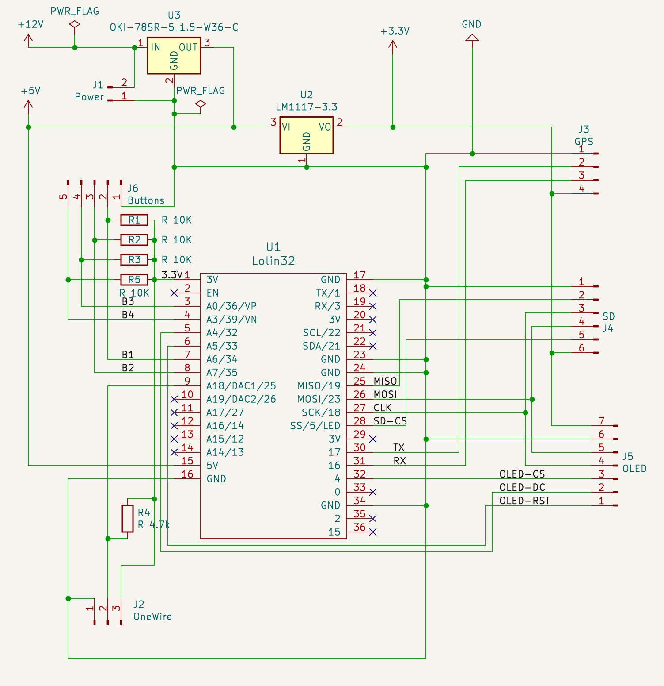

# GpsRouteTracker

## Build status
[](https://github.com/Dennis650/GpsRouteTracker/actions/workflows/push.yaml)

[](https://github.com/Dennis650/GpsRouteTracker/actions/workflows/dependabot.yml)

## Important

!!!EXPERIMENTAL SOFTWARE!!!

!!!EXPERIMENTAL ELECTRICAL CIRCUIT!!!

!!!USE AT YOUR OWN RISK!!!

!!!Do not use the software / circuit / device while driving!!!

## Features

- saves tracks as GPX Files to SD-Card
- saves waypoints to SD-CARD
- Display: 
    -  Compass
    - Fuelmaster
    - Tripmaster
    - Lap StopWatch
    - temperature
    - Direction and distance to a destination or home
- WebInterface (WIFI)
    - download and delete your tracks via 
- Bluetooth / BLE
    - display gps-data
    - edit destination and home location with your smartphone (Bluetooth/BLE)

## Videos

*GpsRouteTracker in action*

[](https://youtu.be/5VfPQfJHMjE)

*Bluetooth (BLE) - Gps-data and edit destination and home location with your smartphone*

[](https://youtu.be/Spw23uVRIWE)

## Circuit



## Parts
- WEMOS LOLIN32 V1.0.0
- 1.5" 128x128 OLED Display solid white
- ublox NEO-6M seriell GPS-Module
- micro sd breakout board 3,3V 6Pin
- SD-Card
- LM1117-3.3
- OKI-78SR-5_1.5-W36-C
- 4 x 10 kOhm
- 1 x 4.7 kOhm
- 3 x 12mm push buttons
- DS18B20 waterproof

## Build and flash to ESP32

connect your ESP32 with USB to your Computer.

You can edit or ad you own bike to platformio/include/bikes. Copy a existing bike and modify the settings. Add your bike also to platformio/platformio.ini

```platformio run -e Prototype --target upload```

## Cases / 3D-Print

https://www.thingiverse.com/thing:6894891

